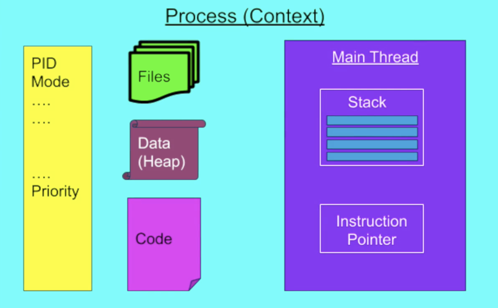
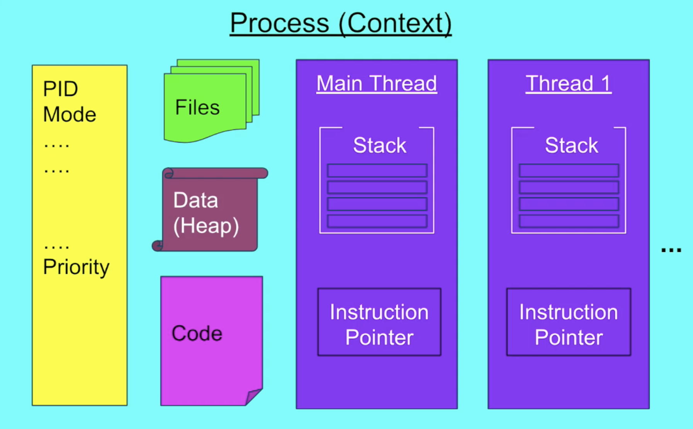

# Learning multi-threading in Java

Learning from [this Udemy course](https://www.udemy.com/course/java-multithreading-concurrency-performance-optimization/).

## Notes

- Need for multi-threading
  - Responsiveness via concurrency: servers able to server multiple requests at once, moving a mouse on a screen during video streaming displays playback controls
  - Performance: running tasks in paralell


- Single threaded Process vs Multi-threaded Process
  - 
  - 


- Performance in Multithreading
  - Latency: the time to completion of a task. Measured in time units.
  - Throughput: the amount of tasks completed in a given period. Measured in tasks/time unit.

- Atomic Operations
  - Assignments to primitive types excluding double and long
  - Assignments to references
  - Assignments to double and long using the volatile keyword

- Race Condition
  - Multiple threads are accessing a shared resource
  - At least one thread is modifying the resource
  - The timing of the threads' scheduling may cause incorrect result
  - The core of the problem is non atomic operations performed on the shared resource.
  - Solution: identify the critical section where race condition is happening and protect it using a synchronized block

- Data Race
  - Compiler and CPU may execute the instructions out of order to optimize performance and utilization (while maintaining logical correctness of code).
  - This is an important compiler and CPU features to speed up the code.
  - This may lead to unexpected and incorrect results in a multi-threaded environment.
  - Solution: establish a happens-before semantic either via synchronized blocks or volatile keywords (as only 1 thread will be able to access that code)
  ```java
  volatile int sharedVar;
  public void method() {
    ... // all instructions will be executed before
    read/write(sharedVar);
    ... // all instructions will be executed after
  }
  ```

  - Conditions for Deadlock
    - Mutual exclusion: only one thread can have exclusive access to a resource
    - Hold and wait: at least one thread is holding a resource and is waiting for another resource
    - Non-preemptive allocation: a resource is released only after the thread is done using it
    - Circular wait: a chain of at least two threads each one is holding one resource and waiting for another resource

  - Solution for Deadlock
    - Enforce a strict order on lock aquision